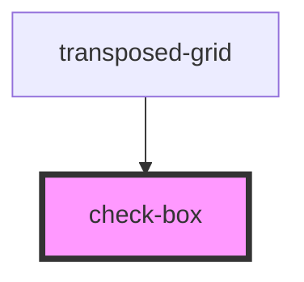

# check-box

<!-- Auto Generated Below -->

## Properties

| Property           | Attribute            | Description | Type                                                                         | Default     |
| ------------------ | -------------------- | ----------- | ---------------------------------------------------------------------------- | ----------- |
| `checkBoxTemplate` | `check-box-template` |             | `((props: CheckBoxOptions) => CustomTemplateFactoryReturnType) \| undefined` | `undefined` |
| `indeterminate`    | `indeterminate`      |             | `boolean \| undefined`                                                       | `undefined` |
| `isSelected`       | `is-selected`        |             | `boolean`                                                                    | `false`     |

## Events

| Event         | Description | Type                                    |
| ------------- | ----------- | --------------------------------------- |
| `checkChange` |             | `CustomEvent<{ isSelected: boolean; }>` |

## Dependencies

### Used by

 - [transposed-grid](../../transposed-grid)

### Graph

----------------------------------------------

*Built with [StencilJS](https://stenciljs.com/)*
