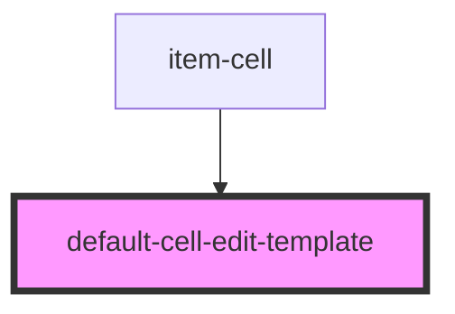

# default-cell-edit-template

<!-- Auto Generated Below -->

## Properties

| Property                  | Attribute        | Description | Type                                                                                                                                                                                                                                                                                                                                                                                                                                                   | Default     |
| ------------------------- | ---------------- | ----------- | ------------------------------------------------------------------------------------------------------------------------------------------------------------------------------------------------------------------------------------------------------------------------------------------------------------------------------------------------------------------------------------------------------------------------------------------------------ | ----------- |
| `data` _(required)_       | --               |             | `{ [x: string]: any; }`                                                                                                                                                                                                                                                                                                                                                                                                                                | `undefined` |
| `group`                   | --               |             | `undefined \| { caption?: string \| undefined; collapsed: boolean; name: string; }`                                                                                                                                                                                                                                                                                                                                                                    | `undefined` |
| `originalValue`           | `original-value` |             | `any`                                                                                                                                                                                                                                                                                                                                                                                                                                                  | `undefined` |
| `primaryKey` _(required)_ | `primary-key`    |             | `string`                                                                                                                                                                                                                                                                                                                                                                                                                                               | `undefined` |
| `row` _(required)_        | --               |             | `{ dataField: string; caption?: string \| undefined; group?: string \| undefined; editing?: EditingOptions \| undefined; allowSorting?: boolean \| undefined; allowHeaderFiltering?: boolean \| undefined; visible?: boolean \| undefined; orderedBy?: SortOrder \| undefined; cellTemplate?: ((props: CustomTemplate<CellTemplate>) => void) \| undefined; editionCellTemplate?: ((props: CustomTemplate<EditCellTemplate>) => void) \| undefined; }` | `undefined` |
| `value`                   | `value`          |             | `any`                                                                                                                                                                                                                                                                                                                                                                                                                                                  | `undefined` |

## Events

| Event         | Description | Type               |
| ------------- | ----------- | ------------------ |
| `valueChange` |             | `CustomEvent<any>` |

## Methods

### `focusInput(options?: FocusOptions) => Promise<void>`

#### Returns

Type: `Promise<void>`

### `selectAll() => Promise<void>`

#### Returns

Type: `Promise<void>`

## Dependencies

### Used by

 - [item-cell](../../item-cell)

### Graph

----------------------------------------------

*Built with [StencilJS](https://stenciljs.com/)*
