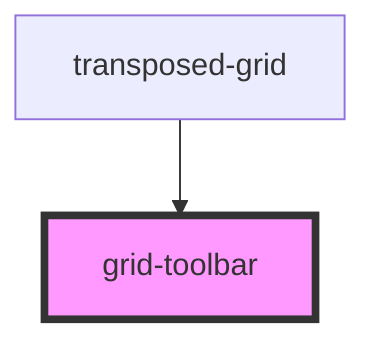

# grid-toolbar

<!-- Auto Generated Below -->

## Properties

| Property          | Attribute | Description | Type                                                             | Default     |
| ----------------- | --------- | ----------- | ---------------------------------------------------------------- | ----------- |
| `center`          | --        |             | `ToolbarButtonOptions[] \| undefined`                            | `undefined` |
| `left`            | --        |             | `ToolbarButtonOptions[] \| undefined`                            | `undefined` |
| `right`           | --        |             | `ToolbarButtonOptions[] \| undefined`                            | `undefined` |
| `toolbarTemplate` | --        |             | `((props: CustomTemplate<ToolbarOptions>) => void) \| undefined` | `undefined` |

## Dependencies

### Used by

 - [transposed-grid](../../transposed-grid)

### Graph

----------------------------------------------

*Built with [StencilJS](https://stenciljs.com/)*
