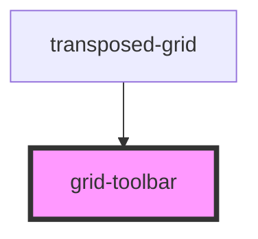

# grid-toolbar

<!-- Auto Generated Below -->

## Properties

| Property          | Attribute          | Description | Type                                                                        | Default     |
| ----------------- | ------------------ | ----------- | --------------------------------------------------------------------------- | ----------- |
| `center`          | `center`           |             | `ToolbarButtonOptions[] \| undefined`                                       | `undefined` |
| `left`            | `left`             |             | `ToolbarButtonOptions[] \| undefined`                                       | `undefined` |
| `right`           | `right`            |             | `ToolbarButtonOptions[] \| undefined`                                       | `undefined` |
| `toolbarTemplate` | `toolbar-template` |             | `((props: ToolbarOptions) => CustomTemplateFactoryReturnType) \| undefined` | `undefined` |

## Dependencies

### Used by

 - [transposed-grid](../../transposed-grid)

### Graph

```mermaid
graph TD;
  transposed-grid --> grid-toolbar
  style grid-toolbar fill:#f9f,stroke:#333,stroke-width:4px
```

----------------------------------------------

*Built with [StencilJS](https://stenciljs.com/)*
