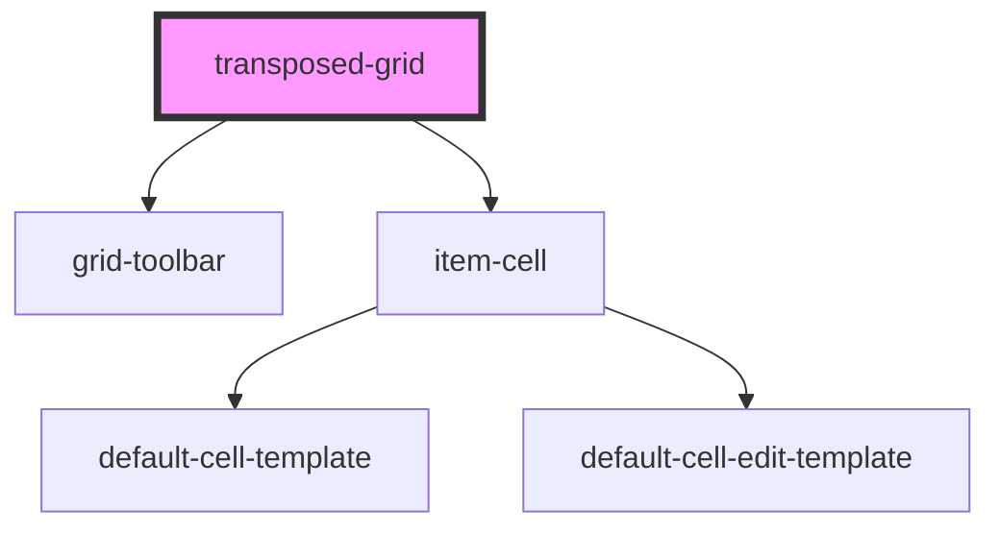

# transposed-grid

<!-- Auto Generated Below -->

## Properties

| Property                    | Attribute                       | Description | Type                                                                                                                                                                                                                                                                                 | Default     |
| --------------------------- | ------------------------------- | ----------- | ------------------------------------------------------------------------------------------------------------------------------------------------------------------------------------------------------------------------------------------------------------------------------------ | ----------- |
| `allowHeaderFiltering`      | `allow-header-filtering`        |             | `boolean \| undefined`                                                                                                                                                                                                                                                               | `undefined` |
| `allowSorting`              | `allow-sorting`                 |             | `boolean \| undefined`                                                                                                                                                                                                                                                               | `undefined` |
| `editing`                   | --                              |             | `RowEditingOptions & { confirmDelete?: boolean \| undefined; startEditAction?: StartEditAction \| undefined; optionRowName?: string \| undefined; texts?: { cancel?: string \| undefined; editRow?: string \| undefined; save?: string \| undefined; } \| undefined; } \| undefined` | `undefined` |
| `focusedRowPrimaryKeyValue` | `focused-row-primary-key-value` |             | `string \| undefined`                                                                                                                                                                                                                                                                | `undefined` |
| `groups`                    | --                              |             | `Group[] \| undefined`                                                                                                                                                                                                                                                               | `undefined` |
| `items`                     | --                              |             | `Data[]`                                                                                                                                                                                                                                                                             | `[]`        |
| `primaryKey`                | `primary-key`                   |             | `string \| undefined`                                                                                                                                                                                                                                                                | `undefined` |
| `rows`                      | --                              |             | `Row[] \| undefined`                                                                                                                                                                                                                                                                 | `undefined` |
| `selection`                 | --                              |             | `undefined \| { allowSelectAll?: boolean \| undefined; mode?: SelectionMode \| undefined; selectAction?: SelectAction \| undefined; }`                                                                                                                                               | `undefined` |
| `striped`                   | `striped`                       |             | `boolean`                                                                                                                                                                                                                                                                            | `true`      |
| `tableClass`                | `table-class`                   |             | `string \| undefined`                                                                                                                                                                                                                                                                | `undefined` |
| `toolbar`                   | --                              |             | `undefined \| { left?: ToolbarButtonOptions[] \| undefined; center?: ToolbarButtonOptions[] \| undefined; right?: ToolbarButtonOptions[] \| undefined; }`                                                                                                                            | `undefined` |
| `toolbarTemplate`           | --                              |             | `((props: CustomTemplate<ToolbarOptions>) => void) \| undefined`                                                                                                                                                                                                                     | `undefined` |

## Events

| Event                 | Description | Type                                                                                                                     |
| --------------------- | ----------- | ------------------------------------------------------------------------------------------------------------------------ |
| `cancel`              |             | `CustomEvent<EditionResult & { data: Data[]; original: Data[]; cancelEdit: boolean; }>`                                  |
| `editionValidation`   |             | `CustomEvent<EditionResult & { data: Data[]; original: Data[]; cancelEdit: boolean; }>`                                  |
| `groupCollapsed`      |             | `CustomEvent<{ group: Group; rows: Row[]; collapsed: boolean; }>`                                                        |
| `itemClick`           |             | `CustomEvent<{ item: Data; itemIdx: number; primaryKey?: string \| undefined; primaryKeyValue?: string \| undefined; }>` |
| `itemDoubleClick`     |             | `CustomEvent<{ item: Data; itemIdx: number; primaryKey?: string \| undefined; primaryKeyValue?: string \| undefined; }>` |
| `itemHoovering`       |             | `CustomEvent<{ item: Data; itemIdx: number; primaryKey?: string \| undefined; primaryKeyValue?: string \| undefined; }>` |
| `itemSelectionChange` |             | `CustomEvent<{ selectedItems: Data[]; mode: SelectionMode; areAllSelected: boolean; status: SelectionStatus; }>`         |
| `save`                |             | `CustomEvent<EditionResult & { data: Data[]; original: Data[]; cancelEdit: boolean; }>`                                  |

## Dependencies

### Depends on

- [grid-toolbar](../toolbar/grid-toolbar)
- [item-cell](../items/item-cell)

### Graph

----------------------------------------------

*Built with [StencilJS](https://stenciljs.com/)*
