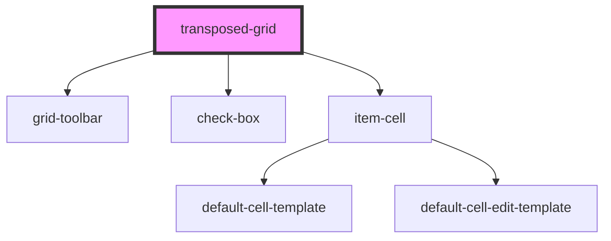

# transposed-grid

<!-- Auto Generated Below -->

## Properties

| Property                    | Attribute                       | Description | Type                                                                                                                                                                                                                                                                                  | Default                                                |
| --------------------------- | ------------------------------- | ----------- | ------------------------------------------------------------------------------------------------------------------------------------------------------------------------------------------------------------------------------------------------------------------------------------- | ------------------------------------------------------ |
| `allowHeaderFiltering`      | `allow-header-filtering`        |             | `boolean \| undefined`                                                                                                                                                                                                                                                                | `undefined`                                            |
| `allowSorting`              | `allow-sorting`                 |             | `boolean \| undefined`                                                                                                                                                                                                                                                                | `undefined`                                            |
| `checkboxTemplate`          | `checkbox-template`             |             | `((props: CheckBoxOptions) => CustomTemplateFactoryReturnType) \| undefined`                                                                                                                                                                                                          | `undefined`                                            |
| `defaultDimensions`         | `default-dimensions`            |             | `ColumnDimensionSettings & RowDimensionSettings`                                                                                                                                                                                                                                      | `{     allowResize: false,     minPixelWidth: 50,   }` |
| `editing`                   | `editing`                       |             | `RecordLevelOptions & { confirmDelete?: boolean \| undefined; startEditAction?: StartEditAction \| undefined; optionRowName?: string \| undefined; texts?: { cancel?: string \| undefined; editRow?: string \| undefined; save?: string \| undefined; } \| undefined; } \| undefined` | `undefined`                                            |
| `fixedGroups`               | `fixed-groups`                  |             | `Group[] \| undefined`                                                                                                                                                                                                                                                                | `undefined`                                            |
| `focusedRowPrimaryKeyValue` | `focused-row-primary-key-value` |             | `string \| undefined`                                                                                                                                                                                                                                                                 | `undefined`                                            |
| `groups`                    | `groups`                        |             | `Group[] \| undefined`                                                                                                                                                                                                                                                                | `undefined`                                            |
| `headerDimensions`          | `header-dimensions`             |             | `ColumnDimensionSettings & RowDimensionSettings \| undefined`                                                                                                                                                                                                                         | `undefined`                                            |
| `height`                    | `height`                        |             | `string \| undefined`                                                                                                                                                                                                                                                                 | `undefined`                                            |
| `items`                     | `items`                         |             | `Data[]`                                                                                                                                                                                                                                                                              | `[]`                                                   |
| `primaryKey`                | `primary-key`                   |             | `string \| undefined`                                                                                                                                                                                                                                                                 | `undefined`                                            |
| `rows`                      | `rows`                          |             | `Row[] \| undefined`                                                                                                                                                                                                                                                                  | `undefined`                                            |
| `selection`                 | `selection`                     |             | `undefined \| { allowSelectAll?: boolean \| undefined; mode?: SelectionMode \| undefined; selectAction?: SelectAction \| undefined; }`                                                                                                                                                | `undefined`                                            |
| `striped`                   | `striped`                       |             | `boolean`                                                                                                                                                                                                                                                                             | `true`                                                 |
| `tableClass`                | `table-class`                   |             | `string \| undefined`                                                                                                                                                                                                                                                                 | `undefined`                                            |
| `toolbar`                   | `toolbar`                       |             | `undefined \| { left?: ToolbarButtonOptions[] \| undefined; center?: ToolbarButtonOptions[] \| undefined; right?: ToolbarButtonOptions[] \| undefined; }`                                                                                                                             | `undefined`                                            |
| `toolbarTemplate`           | `toolbar-template`              |             | `((props: ToolbarOptions) => CustomTemplateFactoryReturnType) \| undefined`                                                                                                                                                                                                           | `undefined`                                            |

## Events

| Event                 | Description | Type                                                                                                                                             |
| --------------------- | ----------- | ------------------------------------------------------------------------------------------------------------------------------------------------ |
| `cancel`              |             | `CustomEvent<EditionResult & { data: Data[]; original: Data[]; } & { cancelEdit: boolean; }>`                                                    |
| `contentRendered`     |             | `CustomEvent<void>`                                                                                                                              |
| `editionEnded`        |             | `CustomEvent<EditionResult & { data: Data[]; original: Data[]; } & { cancelEdit: boolean; }>`                                                    |
| `editionStarted`      |             | `CustomEvent<EditionResult & { data: Data[]; original: Data[]; } & { cancelEdit: boolean; }>`                                                    |
| `editionValidation`   |             | `CustomEvent<EditionResult & { data: Data[]; original: Data[]; } & { isValid: boolean; }>`                                                       |
| `groupToggled`        |             | `CustomEvent<{ group: Group; rows: Row[]; collapsed: boolean; }>`                                                                                |
| `headerClick`         |             | `CustomEvent<{ row?: Row \| undefined; }>`                                                                                                       |
| `headerContextMenu`   |             | `CustomEvent<{ row?: Row \| undefined; }>`                                                                                                       |
| `itemClick`           |             | `CustomEvent<{ item: Data; itemIdx: number; primaryKey?: string \| undefined; primaryKeyValue?: string \| undefined; row?: Row \| undefined; }>` |
| `itemContextMenu`     |             | `CustomEvent<{ item: Data; itemIdx: number; primaryKey?: string \| undefined; primaryKeyValue?: string \| undefined; row?: Row \| undefined; }>` |
| `itemDoubleClick`     |             | `CustomEvent<{ item: Data; itemIdx: number; primaryKey?: string \| undefined; primaryKeyValue?: string \| undefined; row?: Row \| undefined; }>` |
| `itemHovering`        |             | `CustomEvent<{ item: Data; itemIdx: number; primaryKey?: string \| undefined; primaryKeyValue?: string \| undefined; row?: Row \| undefined; }>` |
| `itemSelectionChange` |             | `CustomEvent<{ selectedItems: Data[]; mode: SelectionMode; areAllSelected: boolean; status: SelectionStatus; }>`                                 |
| `save`                |             | `CustomEvent<EditionResult & { data: Data[]; original: Data[]; } & { cancelEdit: boolean; }>`                                                    |

## Methods

### `cancelEdit() => Promise<void>`

#### Returns

Type: `Promise<void>`

### `redraw() => Promise<void>`

#### Returns

Type: `Promise<void>`

### `saveEdit() => Promise<void>`

#### Returns

Type: `Promise<void>`

## Dependencies

### Depends on

- [grid-toolbar](../toolbar/grid-toolbar)
- [check-box](../base/check-box)
- [item-cell](../items/item-cell)

### Graph

```mermaid
graph TD;
  transposed-grid --> grid-toolbar
  transposed-grid --> check-box
  transposed-grid --> item-cell
  item-cell --> default-cell-template
  item-cell --> default-cell-edit-template
  style transposed-grid fill:#f9f,stroke:#333,stroke-width:4px
```

----------------------------------------------

*Built with [StencilJS](https://stenciljs.com/)*
